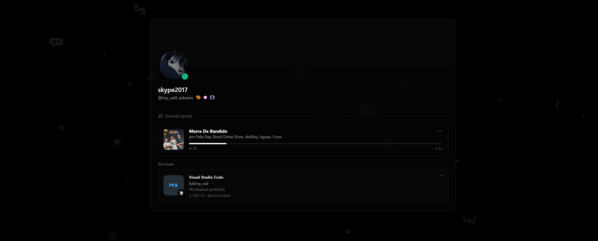

<div align="center">

# Discord Profile API

### A TypeScript API that returns complete Discord profile data in a single request.

User data, Nitro, Boost, Presence, Activities, Connection Status, Badges, Clan Identity, Spotify, VS Code, Connected Accounts, and more — one organized JSON response.

<br>


<br>


</div>

---

<div align="center">

# About

</div>

The **Discord Profile API** makes it easy to retrieve nearly all available information about a Discord user’s profile.

Instead of calling multiple Discord endpoints yourself, this API centralizes everything into one clean, structured JSON response.

Built entirely in **TypeScript** for a clear architecture, strong typing, and easier maintenance.

---

<div align="center">

# API Structure

</div>

</div>

```text
src/
│
├── server.ts
│
├── services/
│   ├── DiscordProfileService
│   ├── BadgeManager
│   ├── BadgeAssetProvider
│   ├── UserVoice
│   ├── UserStatus
│   └── CacheService
│
├── utils/
│   ├── buildBadgeUrl
│   ├── extractHash
│   └── helpers
│
└── routes/
    └── /api/discord/:userId
```

Each class has a single, clear responsibility.

| Class | Responsibility |
| --- | --- |
| DiscordProfileService | Fetches the profile directly from Discord’s API |
| BadgeManager | Calculates Nitro, Boost, and badge data |
| BadgeAssetProvider | Resolves badge assets automatically |
| UserStatus | Detects status and where the user is connected |
| UserVoice | Detects if the user is in a voice channel |
| CacheService | Temporarily stores responses to reduce Discord requests |

---

<div align="center">

# Endpoint

</div>

```text
GET /api/discord/:userId
```

If no ID is provided, the API uses the default user defined in the `.env` file.

---

<div align="center">

# What the API returns

</div>

The response contains structured information about the Discord user, grouped into clear sections.

---

## User

- ID
- Username
- Global Name
- Avatar
- Banner
- Flags
- Creation dates
- Username history
- Display name history
- Avatar Decorations

---

## Presence

The API automatically detects the user’s current presence state.

- Online
- Idle
- DND
- Offline

It also returns:

- Current status
- Status name
- Status color
- Activities
- Rich Presence

---

## Connection Status

The API also detects **where the user is connected to Discord**, separately from voice state.

It can report activity on:

- Discord Web
- Discord Desktop
- Discord Mobile
- Discord Embedded
- Discord VR

These fields show which platforms the user is active on right now. Each platform is tracked independently, so the JSON can report more than one active connection at the same time.

Returned fields:

- `active_on_discord_web`
- `active_on_discord_desktop`
- `active_on_discord_mobile`
- `active_on_discord_embedded`
- `active_on_discord_vr`

Connection status is independent from voice. Being online on Desktop, Web, or Mobile does **not** mean the user is in a voice channel.

---

## Activities

The API automatically identifies different activity types.

- VS Code
- Spotify
- Games
- Streaming
- Custom Status
- Rich Presence

Activities may include:

- Images
- Timestamps
- Details
- Workspace
- Language
- Track
- Artist
- Album
- Application
- Activity state

---

## Nitro

The API automatically calculates Nitro-related information.

- Nitro type
- Start date
- Current badge
- Current badge icon
- Current badge date
- Next badge
- Next badge date

Badge assets are resolved dynamically.

---

## Server Boost

It also calculates automatically:

- Current level
- Level icon
- Boost date
- Next level
- Next level date
- Boost progression

---

## Badges

The API returns badges available on the user’s profile.

Each badge may include:

- ID
- Description
- Icon hash
- Icon URL

---

## Clan Identity

If the user has a clan identity, the API may return:

- Guild ID
- Guild name
- TAG
- Badge
- Badge URL
- Identity state

---

## Connected Accounts

The API also returns accounts linked to the user’s profile, such as:

- GitHub
- Steam
- Xbox
- Spotify
- Twitch
- Reddit
- Twitter/X

Plus other accounts exposed by Discord.

---

## Voice

Voice state works separately from connection status.

When the user is connected to a voice channel, the API can identify:

- Channel
- Channel ID
- Channel name
- Participant count
- Whether the user is alone
- Connected participants
- Mute state
- Deaf state
- Server mute
- Server deaf
- Streaming
- Camera

---

<div align="center">

# Cache System

</div>

The API includes an internal cache to avoid unnecessary repeated calls to Discord.

Benefits:

- Faster responses
- Lower API usage
- Fewer outbound requests
- Lower risk of hitting rate limits

---

<div align="center">

# Environment Variables

</div>

Sensitive values are stored in the `.env` file.

```env
VITE_DISCORD_BOT_TOKEN=YOUR_BOT_TOKEN
DISCORD_USER_TOKEN=YOUR_USER_TOKEN
VITE_DISCORD_ID=USER_ID
VITE_DISCORD_SERVER_ID=SERVER_ID
```

---

<div align="center">

# What each variable is for

</div>

## `VITE_DISCORD_BOT_TOKEN`

Token used by Discord.js to fetch data required by the API, including:

- Presence
- Activities
- Guild
- Member
- Status
- Voice State

---

## `DISCORD_USER_TOKEN`

Token used to access additional profile information from Discord’s profile endpoint, which may include:

- Badges
- Nitro
- Premium Since
- Boost Since
- User Profile
- Clan Identity
- Theme Colors
- Pronouns
- Connected Accounts
- Bio

---

## `VITE_DISCORD_ID`

Default user used when no ID is provided in the route.

---

## `VITE_DISCORD_SERVER_ID`

Guild used by Discord.js to obtain data related to:

- Presence
- Activities
- Connection status
- Voice State
- Boost
- Member

---

<div align="center">

# How to run

</div>

Install dependencies:

```bash
npm install
```

Configure the `.env` file, then start the API:

```bash
npm run dev
```

The API will be available at:

```text
http://localhost:3001
```

---

<div align="center">

# Preview

The API returns all profile information organized into a single JSON response.



</div>

Main response structure:

```text
user
user_profile
clan_identity
presence
voice
nitro
boost
badges
connected_accounts
```

---

<div align="center">

# Features

</div>

<table>
<tr>
<td width="50%" valign="top">

### Profile

- Full Profile
- Avatar
- Banner
- Avatar Decorations
- Bio
- Pronouns
- Theme Colors

</td>
<td width="50%" valign="top">

### Presence

- Presence
- Status
- Connection Status
- Activities
- Rich Presence
- Spotify
- VS Code

</td>
</tr>

<tr>
<td width="50%" valign="top">

### Discord

- Discord Web
- Discord Desktop
- Discord Mobile
- Discord Embedded
- Discord VR
- Nitro
- Server Boost
- Badges
- HypeSquad

</td>
<td width="50%" valign="top">

### Account

- Connected Accounts
- Clan Identity
- Voice State
- Voice Participants
- Cache

</td>
</tr>

<tr>
<td width="50%" valign="top">

### Technology

- TypeScript
- Express
- Discord.js

</td>
<td width="50%" valign="top">

### API

- Real-time Profile Data
- Discord Presence Data
- Activity Detection
- Voice State Detection
- Badge Detection
- Cached Responses

</td>
</tr>
</table>

---

<div align="center">

# Built with TypeScript

A modern API built with **Node.js + Express + TypeScript**, focused on complete Discord profile information through a single endpoint.

**Organized · Typed · Fast · Complete**

</div>
